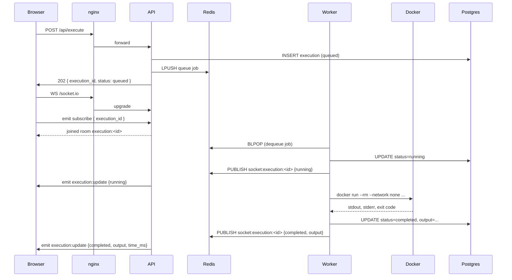

# Technical Design — Code Guru Execution Platform

## 1. System Architecture

### Components

| Component | Technology | Responsibility |
|---|---|---|
| **nginx** | nginx:alpine | Reverse proxy, TLS termination, rate limiting, WebSocket upgrade |
| **Web** | Next.js 14, App Router | Monaco editor UI, real-time output, Socket.io client |
| **API** | Express.js + TypeScript | REST endpoints, Socket.io server, job enqueueing, pub/sub relay |
| **Worker** | Node.js + BullMQ | Job dequeue, Docker sandbox orchestration, state persistence |
| **Redis** | Redis 7 | BullMQ queue, pub/sub event bus, per-user concurrency counters |
| **PostgreSQL** | Postgres 16 | Persistent execution records, audit log |
| **Sandbox** | Docker (ephemeral) | Isolated code execution (node:20-alpine, python:3.11-alpine) |

### Data Flow



---

## 2. Execution Strategy

### Docker Isolation

Each execution gets a brand-new, ephemeral container with the following constraints:

```
docker run
  --rm                           # auto-delete on exit
  --name exec-<uuid>             # unique name for force-kill
  --network none                 # no internet access
  --read-only                    # immutable filesystem
  --tmpfs /tmp:size=10m,noexec   # writable scratch with size cap
  --user nobody                  # non-root user
  --memory 128m                  # memory cap
  --memory-swap 128m             # disable swap
  --cpus 0.5                     # CPU cap
  --pids-limit 64                # prevent fork bombs
  --security-opt no-new-privileges
  --cap-drop ALL                 # no Linux capabilities
  --ulimit nofile=64:64          # file descriptor limit
  --ulimit cpu=5:5               # kernel-level CPU time limit
  -v /tmp/exec-<uuid>/code.js:/code/code.js:ro  # code file only
  node:20-alpine
  timeout 5 node code.js
```

The `timeout` command inside the container provides a second layer of time enforcement beyond the Node.js-level `execFile` timeout.

### Language Support

| Language | Image | Command | Extension |
|---|---|---|---|
| JavaScript | node:20-alpine | `node` | `.js` |
| Python | python:3.11-alpine | `python3` | `.py` |

Adding a new language requires: adding to `SUPPORTED_LANGUAGES`, `DOCKER_IMAGES`, `EXECUTION_COMMANDS`, and `FILE_EXTENSIONS` in the shared constants.

### Docker vs child_process Tradeoffs

| | Docker | child_process |
|---|---|---|
| **Isolation** | Full OS-level isolation | Process-level only |
| **Security** | Network/FS/capability restricted | Can access host FS |
| **Cold start** | ~500ms–1s per container | ~50ms |
| **Resource limits** | Kernel-enforced (cgroups) | Advisory (ulimit) |
| **Cleanup** | Guaranteed (`--rm`) | Must kill manually |
| **Verdict** | ✅ Use for production | Only for trusted code |

The ~500ms Docker overhead is acceptable for a code sandbox. Pre-pulling images eliminates download latency.

---

## 3. Scalability

### Horizontal Worker Scaling

Workers are completely stateless. Scaling is as simple as:

```bash
docker compose up --scale worker=10
```

BullMQ uses Redis-backed distributed locks (`SETNX`) to ensure exactly-once job processing across all workers.

**Capacity math:**
- 10 worker instances × concurrency 10 = **100 parallel Docker executions**
- At 2s average execution time: **50 completions/second**
- At 1000 concurrent users each submitting 1 job: queue drains in ~20 seconds

### Redis Queue Scaling

For extreme throughput:
- **Redis Cluster**: Shard queue keys across nodes (BullMQ supports this natively)
- **Redis Sentinel**: High-availability with automatic failover
- **Queue partitioning**: Separate queues per language or priority tier

### Load Balancing

nginx upstream block with multiple API instances:

```nginx
upstream api {
    server api_1:3001;
    server api_2:3001;
    server api_3:3001;
    keepalive 64;
}
```

Socket.io sticky sessions are **not required** because pub/sub routing is done via Redis — any API instance can relay any event to connected clients.

### Handling Bursts

- BullMQ queue provides buffering (up to 10,000 jobs)
- API returns `503` when queue is full (backpressure)
- Per-user throttle (`PER_USER_MAX_CONCURRENT=3`) prevents any single user from saturating workers
- Workers drain the queue at a controlled rate regardless of submission spikes

---

## 4. Failure Handling

### Timeout Handling

Three layers of timeout enforcement:
1. **Node.js `execFile` timeout** (7s) — kills the child process at the OS level
2. **Docker `timeout` command** (5s) — kills the container process from inside
3. **Docker `--ulimit cpu=5`** — kernel enforces CPU time limit

When timeout is detected, the worker:
- Returns `status: timeout` from `runInDocker`
- Updates Postgres: `status=timeout`
- Publishes socket event: `{status: 'timeout'}`
- `--rm` flag ensures container is deleted automatically

### Worker Crash Recovery

BullMQ's stalled job detection handles worker crashes:
- Jobs "active" for > `stalledInterval` (30s) are moved back to the queue
- `maxStalledCount=1` — after 1 stall, job is moved to failed

### Redis Outage Strategy

If Redis is unavailable:
- API returns `503` (queue is unreachable)
- Workers pause (no jobs to dequeue)
- Postgres retains all execution records — state is not lost
- On Redis recovery: BullMQ reconnects automatically, workers resume

### Docker Failure Handling

If Docker daemon is unavailable:
- Worker catches `ENOENT` / spawn errors
- Classifies as **infrastructure error** — retries up to `MAX_INFRASTRUCTURE_RETRIES=2`
- After max retries: execution marked `failed` in DB
- `forceKillContainer` in finally block ensures no orphaned containers

### Stale Job Recovery

BullMQ's `StalledChecker` runs on `stalledInterval`:
- Scans for jobs that have been "active" too long
- Moves them back to "waiting" for re-processing
- Prevents jobs from being lost if a worker dies mid-execution

---

## 5. State Management

### Redis vs Database Responsibilities

| Concern | Redis | PostgreSQL |
|---|---|---|
| Job queue | ✅ Primary | — |
| Per-user concurrency counters | ✅ Ephemeral | — |
| Socket event routing (pub/sub) | ✅ Transient bus | — |
| Execution lifecycle state | Derived (queue) | ✅ Source of truth |
| Historical audit | — | ✅ Permanent |
| Reconnect recovery | — | ✅ Query current status |

### Reconnect Handling

If a browser disconnects mid-execution and reconnects:
1. Frontend has `execution_id` (from initial submit response or local storage)
2. Frontend calls `GET /api/executions/:id` to get current status
3. If still running: subscribes to socket room, awaits future events
4. If already completed: renders final state immediately

The polling fallback in `useCodeExecution` handles the case where WebSocket is unavailable — it polls the DB every 2 seconds.

---

## 6. Low Bandwidth Optimization

### WebSocket Optimization

- Socket.io `perMessageDeflate` compresses payloads > 1KB
- Event payloads are minimal: only changed fields are included
- No full execution record sent over socket — just status + output

### Batching Strategy

For high-frequency updates (future: streaming stdout), events would be batched:
- Buffer 100ms of output lines
- Send as single payload vs. per-line messages
- Reduces WebSocket frame overhead

### Polling Fallback

`useCodeExecution` implements a 2-tier strategy:
1. **Primary**: Socket.io WebSocket (low latency, efficient)
2. **Fallback**: HTTP polling every 2 seconds if no socket event received within 2s

The polling fallback gracefully handles:
- Corporate firewalls blocking WebSockets
- Proxy configurations that don't support upgrade
- Mobile networks with unstable connections

### Payload Minimization

Socket events carry only what changed:
```json
// queued/running: just status
{ "execution_id": "uuid", "status": "running" }

// completed: status + output
{ "execution_id": "uuid", "status": "completed", "output": "...", "execution_time_ms": 142 }
```

The full execution record (with code, timestamps, etc.) is only fetched on-demand via REST.

---

## 7. Operations

### Deployment

**Docker Compose (single-host):**
```bash
docker compose up --build -d
docker compose logs -f
```

**Kubernetes (multi-host):**
- Deploy API and Worker as separate Deployments
- Redis: use managed Redis (ElastiCache, Upstash)
- Postgres: use managed Postgres (RDS, Neon)
- Worker needs Docker socket access → use DinD (Docker-in-Docker) or Kaniko-like approach in K8s

### Monitoring

Key metrics to track:

| Metric | Source | Alert Threshold |
|---|---|---|
| Queue depth (waiting) | BullMQ / `/metrics` | > 500 |
| Queue depth (failed) | BullMQ / `/metrics` | > 50 |
| Worker active count | BullMQ / `/metrics` | = max concurrency (saturated) |
| Execution p95 latency | Postgres | > 3s |
| Docker error rate | Worker logs | > 5% |
| API error rate (5xx) | nginx / pino logs | > 1% |

### Alerting

Configure alerts on:
1. Redis connection failures (API + Worker logs)
2. Queue depth > 500 (backlog building up)
3. Failed job rate spike (execution failures)
4. Worker count drops to 0 (all workers down)

### Debugging

```bash
# View live logs
docker compose logs -f api worker

# Inspect queue state
docker compose exec api node -e "
  const { Queue } = require('bullmq');
  const q = new Queue('code-execution', { connection: { host: 'redis' } });
  q.getJobCounts().then(console.log);
"

# Query recent executions
docker compose exec postgres psql -U codeexec -c "
  SELECT id, user_id, language, status, execution_time_ms, created_at
  FROM \"Execution\"
  ORDER BY created_at DESC
  LIMIT 20;
"
```

---

## 8. Tradeoffs

### Latency vs Isolation

**Docker adds ~500ms–1s cold start** per execution vs ~50ms for a raw `child_process`. This is the cost of true isolation.

Mitigations:
- Pre-pull images on worker startup
- (Advanced) Container pool: keep N pre-warmed containers ready
- For interactive use (<5s UX budget), 500ms overhead is acceptable

### Performance vs Cost

Running Docker per-execution is resource-intensive. Each container consumes:
- ~50–100MB memory during startup
- CPU for container init
- Disk I/O for image layer reads

Alternative: **gVisor** (runsc runtime) provides similar isolation with lower overhead but requires kernel support.

### Simplicity vs Scalability

The current architecture is designed for horizontal scaling but is simple enough to run on a single machine. Trade-offs made:
- **Redis pub/sub** instead of separate message broker (Kafka/RabbitMQ) — simpler, sufficient for this scale
- **BullMQ** instead of custom queue — battle-tested, Redis-native, good DX
- **Monorepo** — shared types/constants reduce bugs, but adds build complexity

### Docker Cold Start Tradeoffs

| Strategy | Cold Start | Complexity | Cost |
|---|---|---|---|
| New container per job | ~700ms | Low | Low |
| Container pool (pre-warmed) | ~50ms | High | Medium (idle containers) |
| WebAssembly sandbox | ~100ms | Medium | Low |
| gVisor runtime | ~200ms | Medium | Low (needs kernel support) |

The chosen approach (new container per job) is the simplest to reason about and debug. The container pool pattern would be the next optimization step at scale.
